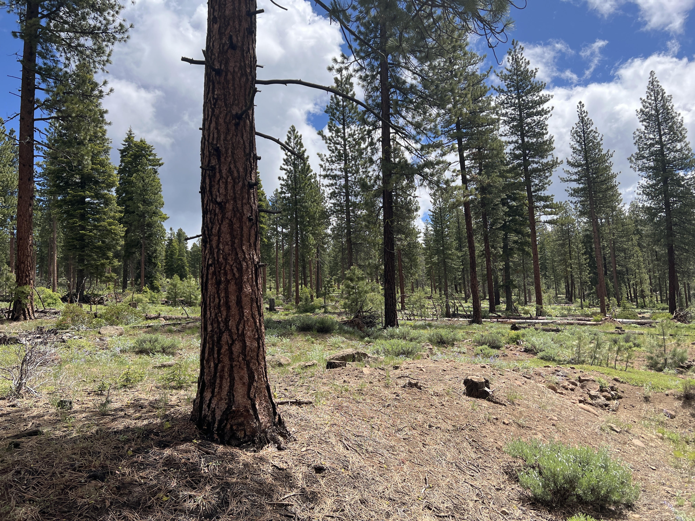

# Welcome!

To the Yuba County Forest Health Book. This book contains a final report on the activities completed for the Yuba Forest Health Project Phase I, generously funded by the Yuba Water Agency. The work was carried out by Keri Rinne, Vance Russell | 3point.xyz, Cherilyn Ashmead, and Allison Thomson | Yuba Watershed Protection and Fire Safe Council. 

## Executive Summary
The Yuba FBA project generated several important findings and recommendations summarized in the following bullet points:

### Findings
More detailed findings can be found throughout the book in general, we found the following:

- Fire. Although severe wildfires have not impacted Yuba County during the past few decades, large fires have occurred on nearly all sides. This may be due to a combination of luck and predominant vegetation types. Still, it has also given the County time to mitigate fire through priority roadsides and forest thinning projects. The northwestern portion of the county is a high-probability zone for future wildfires.
- Capacity. Unlike neighboring Counties, Yuba County’s nonprofit and business capacity in the forest health sector is not high, and project implementers have had to rely on outside capacity to carry out projects.
- Local Workforce. The lower forest health capacity in Yuba County is due in part to the lack of a local workforce.
- Vulnerability of rural communities. Rural communities, especially those in the northwestern portion of the county, are most vulnerable to wildfire due to their remote location, less access to resources, longer distances to travel to evacuate, and possible lack of cell phone signal.
- Water infrastructure.
- Biodiversity.

### Recommendations
More detailed recommendations can be found in the Lessons chapter:

1. Prioritize building capacity of and hiring local businesses. Where they don’t exist or need more experience, work with companies that do and build local capacity while implementing projects with skilled contractors.
2. Many forest health entities and projects are in the startup phase, e.g., the RCD or Camptonville. Supporting these organizations and their projects.
3. Treatment priorities can help reduce fire risk in key areas and carry thin budgets over the landscape. For example, focused treatment in riparian areas on the Yuba River between New Bullards Bar and Englebright Dam may reduce wildfire impacts and further impacts on water infrastructure and systems.
4. Creating a large-scale public-private finance mechanism.

## Table of Contents
Links to book chapters are listed below and in the panel to the left. More details on each chapter are described in the overview chapter and by clicking the book link.

```{tableofcontents}
```

## Jupyterbook
The YWA book was developed with [Jupyter books](https://jupyterbook.org) and is hosted for free and available at [YWA book](https://3point.xyz/ywabook). In the upper right corner, you can view the repository online, download each chapter as a markdown or pdf file, switch to full-screen mode, and toggle between light and dark mode. A search function and links to the chapters are found in the left panel, and when in each chapter, a more detailed outline of the contents, with links to each section, is found in the right panel.



